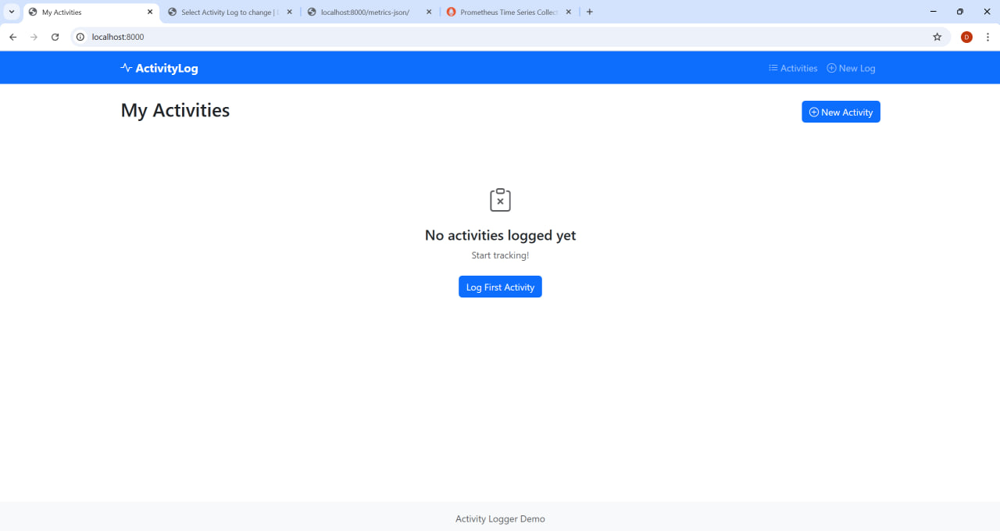

# Activity Logger

A web application that allows users to log their physical activities and processes them in the background using Celery tasks - calculates calories burned.

Built with Django, PostgreSQL, Celery to demonstrate asynchronous task processing and monitoring.

## Features

- Log physical activities with duration, weight, and notes
- Background asynchronous calculation of calories burned with MET formula using Celery tasks
- Complete Docker environment setup with 7 services
- Prometheus metrics for performance monitoring
- Simple monitoring with Redis-based counters
- Activity status updates without page refresh
- Comprehensive logging
- Automatic requeuing of stuck or failed tasks
- Custom implementation of enum

## Stack

- Python 3.11
- Docker & Docker Compose for containerization
- Django 4.2 as web framework
- PostgreSQL 15 for activity logs
- Celery for task processing
- Celery Beat for task schedulling
- Redis as message broker
- Prometheus for monitoring
- HTML, Bootstrap, JavaScript blocks for UI

## Architecture

## Quick Start

1. docker-compose up -d
2. docker-compose exec web python manage.py migrate
3. (optional, for admin panel) docker-compose exec web python manage.py createsuperuser

### Network

- Django web application: [http://localhost:8000/]()
- Admin panel: [http://localhost:8000/admin]()
- Prometheus: [http://localhost:9090/query]()
- Metrics with Redis: [http://localhost:8000/metrics-json/]() 
- PostgreSQL connection on port 5432
- Redis connection on port 6379

## Calculation

Met Formula:

Calories = MET value × Weight (kg) × Duration (hours)

### MET values defined in Activity class, enums.py

- Running: 9.0
- Walking: 3.5
- Cycling: 8.0
- Swimming: 6.5
- Yoga: 4.0

## Quick look

1. Reaching web first time.
   
2. Logging activity.
   
3. New activity is assigned a Celery task.
      
4. Real-time update on task completed with JS.
      
5. Checking details includes processing time and Celery task ID.
     
6. Reaching Django admin panel.
     
7. Monitoring with Redis.
     
8. Prometheus connects to Redis-based metrics.
     
9. Fill DB with activity logs.
     
10. Bootstrap makes it also good for e.g. mobile view.
     
11. Prometheus making graph on query for total calories burned.
     
12. It's unlikely you can do this on purpose in web, but it may happen.
     
13. ... which is not a problem, since Celery Beat schedules to pick these activities again.
     
14. ... and to process the tasks.
    

More cases in demo folder.

## Configurable

- Artificial delay of 5s was added for demonstration purposes, 
  reset delay_time in core/tasks.py
- Pagination: set listview_paginate in views.py (default 10) 
- Task timeout defined with celery_task_limit_seconds in settings.py (30 mins)
- Task retry limit and retry delay: 
  maxretries (3 attempts), retry_time (60 seconds) in tasks.py
- Requeue interval and expiration: 
  requeue_pending_minutes (5 minutes), requeue_expire_minutes (4 minutes) in settings.py

